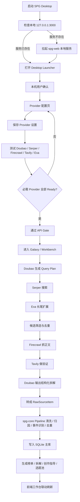
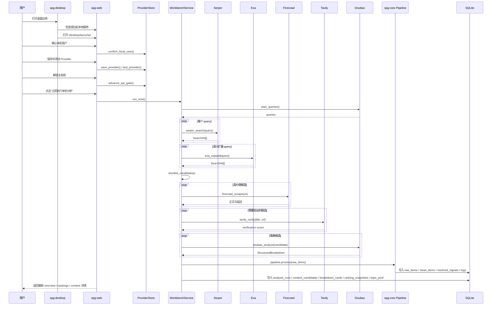

# SPG产品实现逻辑

## 文档目标

这份文档基于本地 `E:\codex\spg-input-layer` 工程做静态分析与只读查询，目标是从产品逻辑、框架搭建、产品事件、API 调用、最终输出五个维度，把 SPG 当前实现讲清楚。

本次分析遵循两个边界：

- 只做代码与本地数据的静态/只读分析。
- 不改动正在运行的 SPG 进程、不改配置、不触碰运行态。

## 一句话结论

SPG 当前不是单纯的数据采集后台，而是一个“桌面壳 + 本机身份闸门 + Provider 配置闸门 + 内容工作台”的本地产品。它的核心目标是围绕 **SLG 赛道的抖音热点内容**，完成从多 Provider 搜索、抓取、验证、结构化分析，到榜单、拆解、创作指导、选题池的闭环输出。

---

## 固定协作机制

从当前版本开始，SPG 主工程的核心研发流程固定接入 `四代理协作机制`，它不再属于临时协作习惯，而是工程主线的一部分。

固定角色如下：

- `代理 A / Maxwell`：产品经理
- `代理 B / Dirac`：软件工程师
- `代理 C / Parfit`：产品 UI 与产品测试运维
- `代理 D / Wegener`：总设计师

固定职责如下：

### A / Maxwell

- 从产品实现、用户体验、用户运营可用性角度提建设意见
- 判断功能是否真的便于使用、是否符合主线目标

### B / Dirac

- 以 Rust 主工程为核心承接技术实现
- 从架构、链路、稳定性、数据闭环角度给出技术判断

### C / Parfit

- 从页面布局、UI 呈现、交互细节、测试运维角度提出意见
- 关注“是否顺畅操作、是否易于验证、是否便于排障”

### D / Wegener

- 汇总 A / B / C 的意见
- 做两轮质询
- 在质询后给出最终决策方案

固定工作顺序如下：

1. 每次更新后，A / B / C 各自独立检查。
2. D 汇总三人的意见，并分别对 A / B / C 做两轮质询。
3. 质询结束后，D 给出最终决策方案。
4. 若没有问题，可以明确写“无新增问题”，不强制制造问题。
5. 所有意见必须以落地和执行为主，不以挑刺为主。

固定复用约束如下：

- 后续默认只使用这四个固定角色，不再临时切换一套新名字。
- 若会话层代理实例失效，必须按 `同名 / 同职责 / 同顺序` 重建后继续。
- 所有产品复盘、工程决策、上线前检查，都以这四个角色体系为唯一标准。

---

## 1. 产品逻辑总览

### 1.1 产品主链路

SPG 的用户路径不是直接进分析页，而是严格分三段：

1. 桌面启动器启动本地服务与桌面窗口。
2. 用户确认“当前机器上的本地用户身份”。
3. 进入 Provider 配置页，完成必需 API 的保存与测试。
4. API Gate 通过后，进入主工作台 `/galaxy`。
5. 在工作台内完成游戏搜索、热点筛选、视频拆解、创作指导、选题池沉淀。

### 1.2 核心产品定位

从工程实现看，SPG 当前更接近一个“本地内容策略工作台”，而不是通用爬虫平台。

它有几个非常明确的产品约束：

- 目标平台默认是 `douyin`。
- 目标赛道聚焦 `slg`。
- 目标对象默认是一组种子 SLG 游戏 watchlist。
- 主输出不是原始抓取结果，而是“可用于决策和创作的结构化内容”。

### 1.3 页面级角色分工

- `desktop/launcher`：桌面启动页，承接本地产品打开瞬间的品牌感和引导。
- `login`：本机用户确认页。
- `setup/providers`：必需 Provider 的保存、测试、解锁页。
- `settings/providers`：运行后的 Provider 设置页。
- `galaxy`：主工作台页面，实际渲染的是 `Workbench`。

---

## 2. 工程与框架搭建

### 2.1 Workspace 分层

工程是一个 Rust workspace，拆成三层：

| 层 | crate | 角色 |
| --- | --- | --- |
| Core 层 | `spg-core` | 清洗、归因、去重、事件识别、SQLite 持久化 |
| Web 层 | `spg-web` | Axum 路由、页面渲染、Provider 配置、调度、工作台 API |
| Desktop 层 | `spg-desktop` | 本地桌面壳，托盘、窗口、WebView、本地服务引导 |

### 2.2 技术栈

- 后端服务：`axum`
- 前端交互：服务端渲染 HTML + 原生 JS 资产文件
- 本地桌面：`tao + wry + tray-icon`
- 网络调用：`reqwest`
- 数据存储：`rusqlite`
- 密钥保存：`keyring` + AES 文件兜底
- 核心分析：`spg-core::SPGInputPipeline`

### 2.3 路由结构

`crates/spg-web/src/lib.rs` 是总路由入口，主要暴露四类能力：

- 页面路由：`/desktop/launcher`、`/login`、`/setup/providers`、`/settings/providers`、`/galaxy`
- Gate 路由：`/api/auth/confirm`、`/api/auth/logout`、`/api/gate-state`、`/api/gate/advance`
- Provider 路由：`/api/providers`、`/api/providers/test-all`、`/api/providers/{provider}`、`/api/providers/{provider}/test`
- Workbench / Galaxy 路由：`/api/workbench/*`、`/api/galaxy/*`

### 2.4 桌面壳逻辑

`crates/spg-desktop/src/main.rs` 的职责是：

- 检查 `127.0.0.1:3000` 上本地服务是否已存在。
- 若不存在，则直接在本机线程里拉起 `spg-web`。
- 使用 `Wry` 加载 `http://127.0.0.1:3000/desktop/launcher`。
- 提供托盘菜单：打开主窗口、退出登录、退出应用。
- 记住用户“关闭窗口时是退出还是最小化到托盘”。

这意味着 SPG 的产品体验是明显“桌面优先”的，而不是浏览器优先。

---

## 3. 产品事件体系

这里的“产品事件”可以分成两层：用户操作事件、系统运行事件。

### 3.1 用户操作事件

#### 入口与门禁事件

- 点击“确认并进入 API 配置”
- 点击“测试全部 API”
- 点击“测试单个 Provider”
- 点击“进入主系统”
- 点击“退出登录”

#### 工作台交互事件

- 搜索游戏关键词
- 点击 watchlist 游戏快捷项
- 选择某个游戏热度项
- 选择某个事件筛选项
- 选择某条视频内容
- 点击“立即执行本轮分析”
- 点击“加入选题池”
- 移除选题池条目
- 更新策略配置

### 3.2 系统运行事件

#### 调度事件

- `start_scheduler()` 启动后台定时器
- 每 `300s` 触发一次 `run_scheduled_if_due()` 检查
- 当达到 `schedule_interval_hours` 时触发自动分析
- 用户也可通过 `run_now()` 手动触发分析

#### 状态恢复事件

- 服务启动时会恢复 stale run
- 若某次 run 卡在 `running` 且超出 30 分钟，则会被回收标记为失败
- 若 Gate 已失效或必需 Provider 不再 ready，主系统访问会被重新锁回 `setup/providers`

### 3.3 事件驱动的页面联动

前端 `crates/spg-web/assets/workbench_v3.js` 是非常典型的“页面状态机”：

- 搜索词变化 -> 拉取游戏榜单/事件榜单/内容榜单
- 选中游戏 -> 拉取该游戏的 `galaxy focus` + 内容排行
- 选中事件 -> 重算内容榜单
- 选中内容 -> 拉取拆解明细与创作指导
- 加入选题池 -> 立即刷新 overview 与 topic pool
- 保存策略 -> 更新 `workbench_settings`

所以这个产品不是单页静态展示，而是“若干页面状态 + 若干后台快照”共同驱动出来的交互工作台。

---

## 4. API 调用逻辑与调度策略

### 4.1 当前代码里的主 Provider

当前实际在 `ProviderKind` 中启用的是五个核心 Provider：

| Provider | 角色 | 默认职责 |
| --- | --- | --- |
| Doubao | 主分析器 | 生成 query plan、做结构化内容分析 |
| Serper | 主搜索 | 高优先级发现入口 |
| Firecrawl | 正文抓取 | 为高价值页面补正文 |
| Tavily | 验证 | 交叉验证热点 |
| Exa | 扩展 | 长尾语义扩展 |

说明：

- 数据库 `provider_settings` 中目前还能看到 `gemini` 记录，但当前代码主干并未把它纳入 `ProviderKind::ALL`，更像历史残留配置。

### 4.2 默认预算策略

`workbench.rs` 中对预算做了明确约束：

| Provider | 月上限 | 日软上限 | 预留池 | 单轮上限 |
| --- | --- | --- | --- | --- |
| Doubao | 99999 | 5000 | 0 | 12 |
| Serper | 2500 | 60 | 700 | 5 |
| Exa | 1000 | 24 | 280 | 2 |
| Tavily | 1000 | 24 | 280 | 2 |
| Firecrawl | 500 | 12 | 140 | 1 |

其中 `Serper` 还有一个特殊规则：哪怕预算接近下限，也尽量保留最少一次发现机会，避免发现层完全归零。

### 4.3 单轮分析执行顺序

`execute_run()` 的实际顺序很清晰：

1. 读取 `workbench_settings`
2. 读取当前 runtime Provider 配置
3. 读取最近内容标题，作为历史上下文
4. 调用 `Doubao.plan_queries()` 生成 query plan
5. 依次调用 `Serper.search()` 进行发现
6. 从发现结果中抽取语义种子，调用 `Exa.expand()` 做长尾扩展
7. 用 shortlist 规则筛出候选内容
8. 对候选内容调用 `Firecrawl.scrape()` 补正文
9. 对候选内容调用 `Tavily.verify()` 补交叉验证
10. 对候选内容调用 `Doubao.analyze()` 输出结构化拆解
11. 将候选内容转成 `spg-core::RawSourceItem`
12. 进入 `SPGInputPipeline.process()`
13. 持久化 pipeline 结果
14. 回填 game/event 归因、计算 hotness
15. 生成 content/game/event 三类 ranking
16. 持久化 `analysis_runs / ranking_snapshots / content_candidates / breakdown_cards`

### 4.4 候选筛选规则

候选筛选逻辑体现出很强的产品取舍：

- 先去重：按 URL + title 的归一 identity 去重
- 再做时间窗过滤：必须落在 `time_window_hours`
- 再优先匹配 watchlist 术语与 SLG 相关度
- 若严格匹配拿不到结果，再退化到 watchlist 命中
- 还拿不到，再退化到“最近结果前 N 条”

这说明产品优先级是：

1. 赛道相关
2. 监控游戏相关
3. 时间新鲜
4. 找不到时允许适度回退

### 4.5 热度分计算

最终内容热度 `hotness_score` 由四部分加权：

```text
hotness = 0.35 * engagement_score
        + 0.25 * freshness_score
        + 0.20 * cross_source_score
        + 0.20 * doubao_relevance_score
```

这代表 SPG 最终不是按单一平台热度排序，而是“传播性 + 新鲜度 + 外部验证 + 主题相关性”的综合分。

---

## 5. SPG Core Pipeline 逻辑

`spg-core` 的角色不是调 API，而是把各种来源的内容变成统一信号。

### 5.1 Pipeline 输入对象

每条输入会先变成 `RawSourceItem`，字段包括：

- `source_id`
- `platform`
- `source_type`
- `content_type`
- `title`
- `text`
- `author`
- `published_at`
- `url`
- `raw_metrics`
- `metadata`

### 5.2 Pipeline 处理阶段

#### Clean

- 平台标准化
- URL 标准化
- 时间标准化
- 文本标准化
- token 化
- fingerprint 计算
- 引用 URL 抽取

#### Candidate Identification / Entity Resolution

- 从标准名、别名、官方账号、官方 URL seed 中匹配游戏候选
- 计算候选分数
- 在游戏级别、赛道级别、未归因三种 scope 中做决策

#### Event Attribution

- 根据 `event_rules` 给内容打事件类型
- 如 `season / version / commander / alliance_war / balance / collab / controversy / activity / test / launch`

#### Dedupe

- 内容近重复折叠
- 信息重复折叠
- 为重复组保留 canonical signal

#### Output

输出 `PipelineRunResult`，里面包含：

- `clean_items`
- `signals`
- `dedupe_groups`
- `resolution_logs`
- `unresolved_records`
- `metrics`

### 5.3 Asset Bundle 的作用

`data/entity_assets.json` 提供了：

- SLG 游戏标准名
- 社区别名与弱别名
- 官方账号
- 官方 URL seeds
- 负面别名黑名单
- 事件规则关键词

本地当前资产里已经覆盖至少 7 个 SLG 重点游戏，包括：

- 率土之滨
- 三国群英传策定九州
- 三国谋定天下
- 无尽冬日
- 三国冰河时代
- 天下归心
- 九牧之野

---

## 6. 最终输出结构

### 6.1 配置库与主业务库分离

SPG 当前把数据明确拆成两套库：

| 数据库 | 角色 |
| --- | --- |
| `data/spg_web.db` | Provider 配置、Provider 测试记录、Quota 快照、Gate 状态 |
| `data/spg_input_layer.db` | Pipeline 主库 + Workbench 业务结果库 |

### 6.2 `spg_web.db` 主要表

- `provider_settings`
- `provider_test_logs`
- `provider_quota_ledger`
- `app_gate_state`

这套库服务于“能不能进系统”的问题。

### 6.3 `spg_input_layer.db` 主要表

#### Pipeline 输出表

- `pipeline_runs`
- `raw_items`
- `clean_items`
- `resolved_signals`
- `dup_groups`
- `entity_aliases`
- `resolution_logs`
- `unresolved_pool`

#### Workbench 输出表

- `analysis_runs`
- `content_candidates`
- `breakdown_cards`
- `ranking_snapshots`
- `topic_pool`
- `workbench_settings`
- `api_budget_usage`

这说明 SPG 的最终输出不是一个单一 JSON，而是一套“可审计、可回看、可筛选、可解释”的本地 SQLite 结果层。

### 6.4 用户实际可见输出

当前用户最终可见的输出主要有四类：

1. 内容候选列表：`content_candidates`
2. 视频拆解卡片：`breakdown_cards`
3. 三类榜单：`ranking_snapshots`
   - content ranking
   - game ranking
   - event ranking
4. 选题池：`topic_pool`

换句话说，SPG 的最终产品化输出不是“抓到了多少条”，而是：

- 现在什么最热
- 哪个游戏最值得盯
- 哪个事件正在上升
- 哪条视频值得拆
- 这条内容能怎么改写成创作选题

---

## 7. 当前本地工程的实际观测

以下内容来自对本地数据库和配置的只读查询，时间以当前会话分析时点为准。

### 7.1 Provider 当前状态

本地 `spg_web.db` 中当前能看到：

- `local_user_confirmed = 1`
- `api_gate_passed = 1`
- 最近一次核心 Provider 测试全为 `ready`

最近一次可见测试时间为 **2026-04-13**，主要 Provider 包括：

- Doubao
- Serper
- Firecrawl
- Tavily
- Exa

### 7.2 当前工作台策略配置

`workbench_settings` 当前配置是：

- `platform = douyin`
- `time_window_hours = 24`
- `schedule_interval_hours = 2`
- `max_candidates_per_run = 50`
- `doubao_model = doubao-seed-2-0-code-preview-260215`
- watchlist 为 7 个种子 SLG 游戏

### 7.3 当前 API 调用痕迹

在 `api_budget_usage` 中能看到 2026-04-14 的真实调用轨迹：

- `Serper` 已执行多次 `search`
- `Exa` 已执行 `expand`
- `Tavily` 已执行 `verify`

这说明真实的发现与扩展链路已经跑起来了。

### 7.4 当前失败现状

本地主库 `analysis_runs` 中最近几次 run 全部是 `failed`，典型错误包括：

- `error sending request for url (https://ark.cn-beijing.volces.com/api/v3/chat/completions)`
- `this run did not discover any eligible douyin candidates`
- `stale run recovered before live scheduling`

截至本次分析时，当前库中：

- `content_candidates = 0`
- `breakdown_cards = 0`
- `ranking_snapshots(is_current=1) = 0`
- `topic_pool = 0`

因此可以判断：

> SPG 的门禁、配置、调度、发现层已经具备产品形态，但主价值输出链路目前被“Doubao 请求失败 / 候选发现不足”卡住，所以没有形成当前快照。

这也是当前产品实现和产品结果之间最关键的落差点。

---

## 8. 产品视角下的优势与缺口

### 8.1 已经做对的部分

- 桌面壳、身份确认、Provider Gate 让产品有了清晰的进入秩序。
- `spg-core` 和 `spg-web` 分层清楚，数据与 UI 责任分离明确。
- 主工作台不是“原始结果页”，而是“榜单 + 拆解 + 创作指导 + 选题池”的策略界面。
- SQLite 表设计较完整，天然支持审计、回放和追根溯源。
- 预算与 quota 逻辑已经不是 demo 级别，而是具备真实生产约束意识。

### 8.2 当前最主要的缺口

- 主分析链路对 `Doubao` 成功率依赖太高，一旦失败，整个结果层无法出快照。
- 当前 `Galaxy` 页面路径名仍沿用星图概念，但实际主工作台已经是 `Workbench`，命名和表达存在漂移。
- 数据库里出现 `Gemini` 配置残留，但代码主链并未纳入，产品表述和实现存在不一致。
- 当前结果层为空时，产品虽然能打开，但用户得到的业务价值仍然不够。

---

## 9. 流程图



## 10. 时序图



## 11. 代码锚点

以下文件是这份分析最关键的代码锚点：

- `crates/spg-web/src/lib.rs`
- `crates/spg-web/src/workbench.rs`
- `crates/spg-web/src/store.rs`
- `crates/spg-web/src/secret_store.rs`
- `crates/spg-web/src/galaxy.rs`
- `crates/spg-web/assets/workbench_v3.js`
- `crates/spg-web/assets/setup.js`
- `crates/spg-web/src/ui_shell.rs`
- `crates/spg-desktop/src/main.rs`
- `crates/spg-core/src/pipeline.rs`
- `crates/spg-core/src/storage.rs`
- `data/entity_assets.json`

## 12. 结论

当前 SPG 工程已经完成了明确的产品化骨架：

- 有桌面入口
- 有本机身份门禁
- 有 API 门禁
- 有多 Provider 调度
- 有统一的 Pipeline
- 有榜单、拆解、创作指导和选题池结果层

它当前最关键的问题，不是“有没有产品逻辑”，而是：

> 主结果链路已经具备闭环设计，但最新几轮运行没有成功产出当前快照，导致产品价值没有在前台完全显现。

如果从产品实现成熟度来看，SPG 现在已经不是 0 到 1 的概念工程，而是 1 到 10 阶段里“骨架基本成型、核心链路待稳定”的状态。
